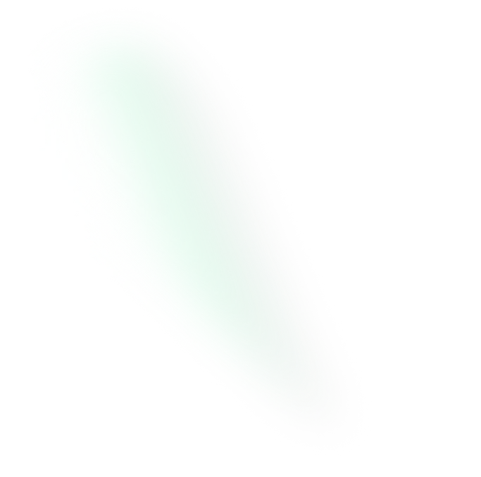

 <form action="https://api.web3forms.com/submit" method="POST" id="contact-form">

                                <!-- Web3Forms Access Key -->
                                <input type="hidden" name="access_key" value="9a35a149-95c3-4cad-b25a-f1949f36d3f7" />

                                <!-- Optional: Email Subject -->
                                <input type="hidden" name="from_name" value="Roli Verma Portfolio">

                                

                                    <fieldset>

                                        <input id="name" type="text" placeholder="Your Name" name="name" tabindex="1"
                                            aria-required="true" required />

                                    </fieldset>

                                    <fieldset>

                                        <input id="email" type="email" placeholder="Your Email" name="email"
                                            tabindex="2" aria-required="true" required />

                                    </fieldset>

                                    <fieldset>

                                        <input id="subject" type="text" placeholder="Project Subject" name="subject"
                                            tabindex="3" aria-required="true" required />

                                    </fieldset>

                                    <fieldset>

                                        <textarea id="message" rows="4" placeholder="Tell me about your project..."
                                            name="message" tabindex="4" aria-required="true" required></textarea>

                                    </fieldset>

                                

                                <!-- Project Type -->

                               

                                <!-- Submit Button -->

                                

                                    <button class="tf-btn style-1 animate-hover-btn" type="submit" id="submit-btn">

                                        
                                            Send Message
                                        

                                    </button>

                                

                                <!-- Success / Error Message -->

                                

                                

                                

                                    

                                

                                

                            </form>